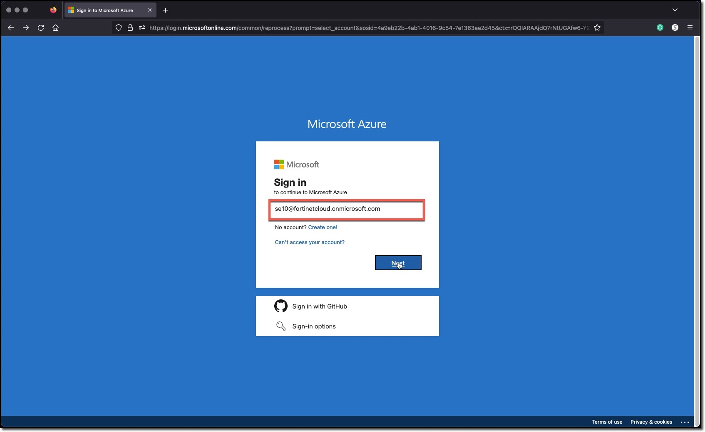
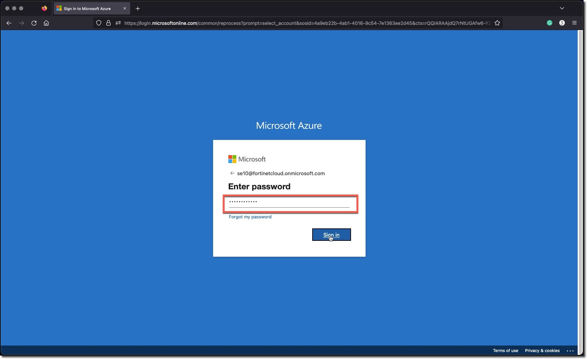
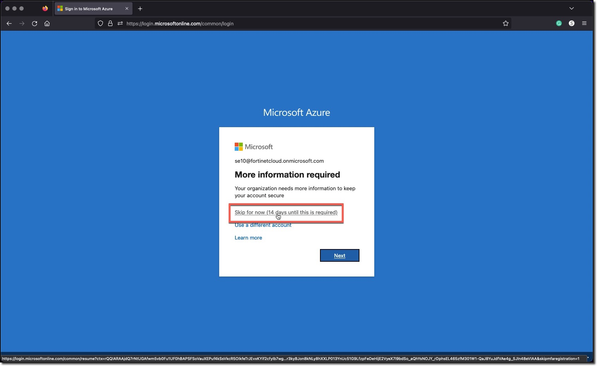
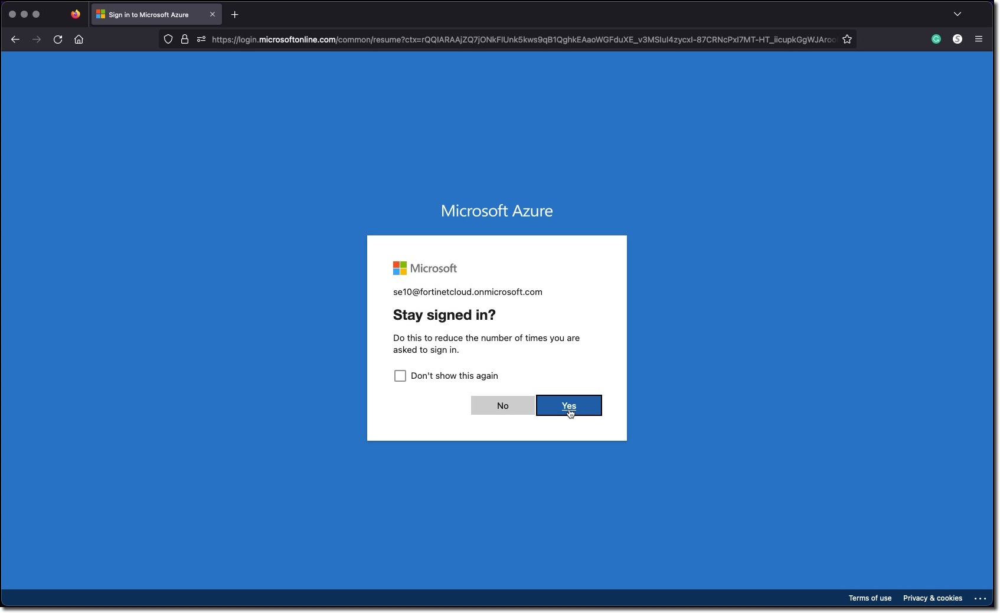
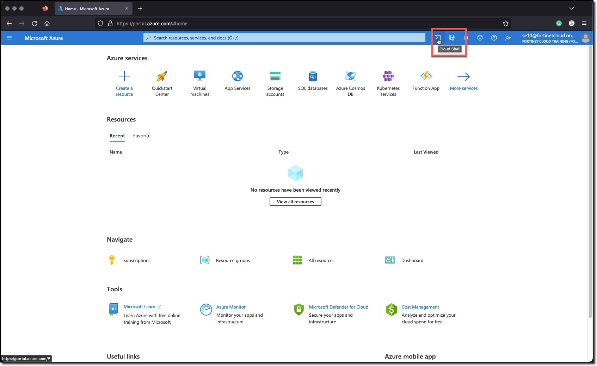
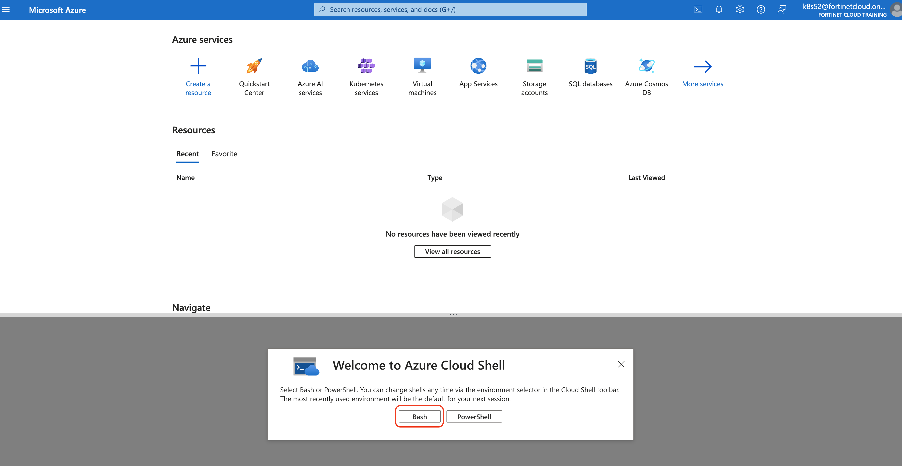
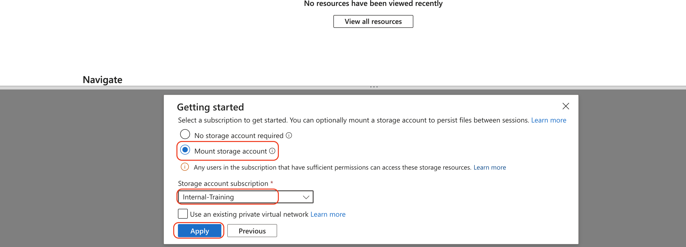
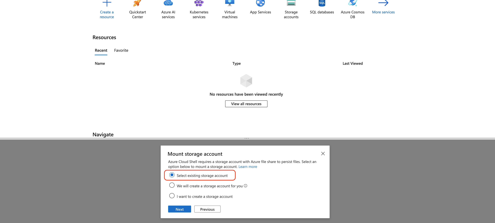
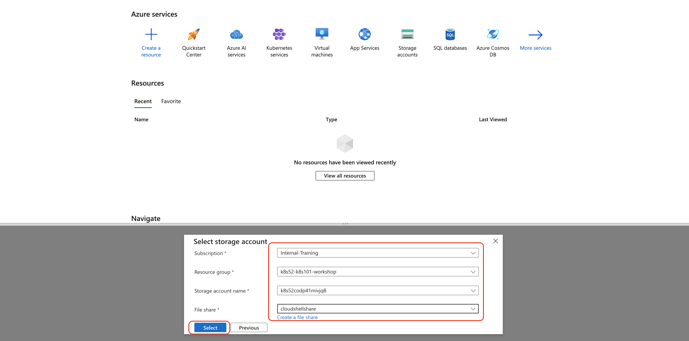
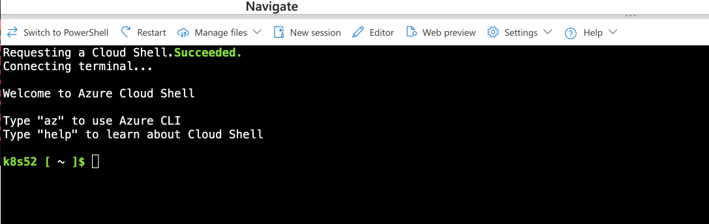

#### 1. **Setup your AzureCloud Shell**

* Login to Azure Cloud Portal [https://portal.azure.com/](https://portal.azure.com/) with the provided login/password

    
    

* Click the link "Skip for now (14 days until this is required)" do not click the "Next" button

    

* Click the "Next" button

    

* Click on Cloud Shell icon on the Top Right side of the portal

    

* Select **Bash**

    

* Click on **Mount Storage Account**

    
* Select
  * Storage Account Subscription - **Internal-Training**
  * Apply

* Click **Select existing Storage account**, Click Next

    

* in Select Storage account Step, 

   * Subscription: **Internal-Training**
   * Resource Group: Select the Resource group from the drop down: **K8sXX-K8s101-workshop**
   * Storage Account: Use existing storage account from dropdown.
   * File share: Use **cloudshellshare**
   * Click Select

    

  Please make sure to use the existing ones. you wont be able to create any Resource Group or Storage account
    

* After 1-2 minutes, You should now have access to Azure Cloud Shell console

    