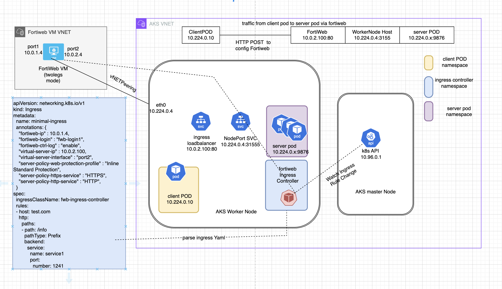
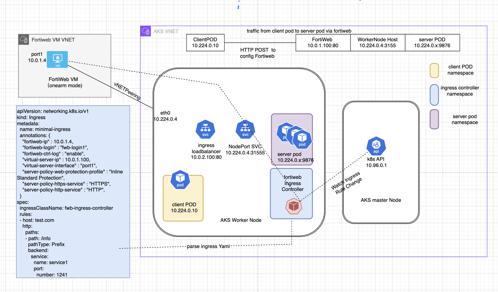

#### Network Diagram
In this chapter, we are going to create a lab setup as illustrated in the network diagram below.

Fortiweb can be configured with two ports: port1 for incoming traffic and port2 for proxy traffic to the backend application. This is called the twoarms mode here.

**Fortiweb TwoLegs Mode**


Fortiweb can also be configured with a single port, where port1 handles both incoming traffic and proxy traffic to the backend application. This is called the one-arm mode.

**Fortiweb OneArm Mode**



In this workshop, you can choose to use twoarms mode or onearm mode.

#### Prepare Environemnt Variables


```bash
read -p "Enter deploy mode (twoarms/onearm) [twoarms]: " fortiwebdeploymode
fortiwebdeploymode=${fortiwebdeploymode:-twoarms}
echo $fortiwebdeploymode 
if [ "$fortiwebdeploymode" == "twoarms" ]; then
    secondaryIp="10.0.2.100"
else
    secondaryIp="10.0.1.100"
fi
owner="tecworkshop"
currentUser=$(az account show --query user.name -o tsv)
resourceGroupName=$(az group list --query "[?tags.UserPrincipalName=='$currentUser'].name" -o tsv)
if [ -z "$resourceGroupName" ]; then
    resourceGroupName=$owner-$(whoami)-"fortiweb-"$location-$(date -I)
    az group create --name $resourceGroupName --tags UserPrincipalName=$currentUser --location $location
    resourceGroupName=$resourceGroupName
fi
location=$(az group show --name $resourceGroupName --query location -o tsv)
echo "Using resource group $resourceGroupName in location $location"

cat << EOF | tee > $HOME/variable.sh
#!/bin/bash -x
vnetName="FortiWeb-VNET"
aksVnetName="AKS-VNET"
imageName="fortinet:fortinet_fortiweb-vm_v5:fortinet_fw-vm:latest"
fortiwebUsername="azureuser"
fortiwebPassword='Welcome.123456!'
fortiwebvmdnslabel="$(whoami)fortiwebvm7"
aksClusterName=$(whoami)-aks-cluster
rsakeyname="id_rsa_tecworkshop"
vm_name="$(whoami)fortiwebvm7.${location}.cloudapp.azure.com"
fortiwebvmdnslabelport2="$(whoami)px2"
svcdnsname="$(whoami)px2.${location}.cloudapp.azure.com"
remoteResourceGroup="MC"_${resourceGroupName}_$(whoami)-aks-cluster_${location} 
nicName1="NIC1"
nicName2="NIC2"
EOF
echo fortiwebdeploymode=$fortiwebdeploymode >> $HOME/variable.sh
echo secondaryIp=$secondaryIp >> $HOME/variable.sh
echo location=$location >> $HOME/variable.sh
echo owner=$owner >> $HOME/variable.sh
echo resourceGroupName=$resourceGroupName >> $HOME/variable.sh
chmod +x $HOME/variable.sh
line='if [ -f "$HOME/variable.sh" ]; then source $HOME/variable.sh ; fi'
grep -qxF "$line" ~/.bashrc || echo "$line" >> ~/.bashrc
source $HOME/variable.sh
$HOME/variable.sh
if [ -f $HOME/.ssh/known_hosts ]; then 
grep -qxF "$vm_name" "$HOME/.ssh/known_hosts"  && ssh-keygen -R "$vm_name"
fi
```

#### Create Kubernetes Cluster

We can use either managed K8s like AKS, EKS  or self-managed k8s like kubeadm etc., in this workshop, let's use AKS. 

We will create aks VNET and Fortiweb VNET in same resourceGroup, in reality, you can also create them in different resourceGroup. 

**create aks VNET and subnet**

```bash
az network vnet create -g $resourceGroupName  --name  $aksVnetName --location $location  --subnet-name aksSubnet --subnet-prefix 10.224.0.0/24 --address-prefix 10.224.0.0/16
```

**get aksSubnetId** 

this aksSubnetId will be need when create AKS. 

```bash
aksSubnetId=$(az network vnet subnet show \
  --resource-group $resourceGroupName \
  --vnet-name $aksVnetName \
  --name aksSubnet \
  --query id -o tsv)
echo $aksSubnetId
```
**create AKS cluster**

```bash
[ ! -f ~/.ssh/$rsakeyname ] && ssh-keygen -t rsa -b 4096 -q -N "" -f ~/.ssh/$rsakeyname

az aks create \
    --name ${aksClusterName} \
    --node-count 1 \
    --vm-set-type VirtualMachineScaleSets \
    --network-plugin azure \
    --location $location \
    --service-cidr  10.96.0.0/16 \
    --dns-service-ip 10.96.0.10 \
    --nodepool-name worker \
    --resource-group $resourceGroupName \
    --kubernetes-version 1.28.9 \
    --vnet-subnet-id $aksSubnetId \
    --only-show-errors \
    --ssh-key-value ~/.ssh/${rsakeyname}.pub
az aks get-credentials -g  $resourceGroupName -n ${aksClusterName} --overwrite-existing

```
Check Creation result with 
```
kubectl get node  -o wide
```
you shall found node are in "ready" status and "VERSION" is v.1.28.9, the node shall have an internal ip assigned. 

```
NAME                             STATUS   ROLES   AGE     VERSION   INTERNAL-IP   EXTERNAL-IP   OS-IMAGE             KERNEL-VERSION      CONTAINER-RUNTIME
aks-worker-12061195-vmss000000   Ready    agent   8m51s   v1.28.9   10.224.0.4    <none>        Ubuntu 22.04.4 LTS   5.15.0-1064-azure   containerd://1.7.15-1
```

Check the Vnet of this aks cluster.

```bash
az network vnet list -g $resourceGroupName -o table
```

you will find azure created  a Vnet for this AKS.
```
k8s51 [ ~ ]$ az network vnet list -g $resourceGroupName -o table
Name      ResourceGroup          Location    NumSubnets    Prefixes       DnsServers    DDOSProtection    VMProtection
--------  ---------------------  ----------  ------------  -------------  ------------  ----------------  --------------
AKS-VNET  k8s51-k8s101-workshop  eastus      1             10.224.0.0/16                False
```


#### Deploy FortiWeb VM in dedicated VNET 

In this workshop, We are going to deploy FortiWeb VM in it's own VNET, FortiWeb will use twoarms or onearm  deployment model, below lists the components going to be deployed 
- VNET : 10.0.0.0/16 
- Subnet1: 10.0.1.0/24
- Subnet2: 10.0.2.0/24 when fortiweb in twoarms mode
- NSG : allow all traffic 
- NIC1 with Public IP for SSH access and Management, in Subnet1
- NIC2 for internal traffic, in Subnet2, when fortiweb in twoarms mode
- VM with Extra DISK for log

**Create VNET with Subnet1**

```bash
az network vnet create \
  --resource-group $resourceGroupName \
  --name $vnetName \
  --location $location \
  --address-prefix 10.0.0.0/16 \
  --subnet-name ExternalSubnet \
  --subnet-prefix 10.0.1.0/24
```
**Create Subnet2 in same VNET if use twoarms mode**

```bash
if [ "$fortiwebdeploymode" == "twoarms" ]; then 
az network vnet subnet create \
  --resource-group $resourceGroupName \
  --vnet-name $vnetName \
  --name InternalSubnet \
  --address-prefix 10.0.2.0/24
fi
```

**Create NGS with Rule**

this NSG will be attached to Fortiweb VM NICs.

```bash
az network nsg create \
  --resource-group $resourceGroupName \
  --location $location \
  --name MyNSG

az network nsg rule create \
  --resource-group $resourceGroupName \
  --nsg-name MyNSG \
  --name AllowAll \
  --protocol '*' \
  --direction Inbound \
  --priority 1000 \
  --source-address-prefix '*' \
  --source-port-range '*' \
  --destination-address-prefix '*' \
  --destination-port-range '*'
```

**Create PublicIP with a DNS name**

this publicip serve for mgmt purpose, we can use this ip for SSH and WebGUI to Fortiweb VM via IP address or DNS name

the Fortiweb factory default configuration only have SSH service and WebGUI service enabled on Port1. so this Public IP will be associated to Fortiweb VM Port1. 

```bash
az network public-ip create \
  --resource-group $resourceGroupName \
  --location $location \
  --name FWBPublicIP \
  --allocation-method Static \
  --sku Standard \
  --dns-name $fortiwebvmdnslabel \
  --only-show-errors 
```

**Create NIC1 and attach PublicIP**

```bash
az network nic create \
  --resource-group $resourceGroupName \
  --location $location \
  --name NIC1 \
  --vnet-name $vnetName \
  --subnet ExternalSubnet \
  --network-security-group MyNSG \
  --public-ip-address FWBPublicIP

az network nic update \
    --resource-group $resourceGroupName \
    --name NIC1 \
    --ip-forwarding true

```

**Create NIC2 if Fortiweb use twoarms mode**

```bash
if [ "$fortiwebdeploymode" == "twoarms" ]; then 
az network nic create \
  --resource-group $resourceGroupName \
  --location $location \
  --name NIC2 \
  --vnet-name $vnetName \
  --subnet InternalSubnet \
  --network-security-group MyNSG

az network nic update \
    --resource-group $resourceGroupName \
    --name NIC2 \
    --ip-forwarding true
fi 
```

#### Deploy FortiWeb VM 

**Create VM with storage Disk**

```bash
if [ "$fortiwebdeploymode" == "twoarms" ]; then 
nics="NIC1 NIC2" 
else
nics="NIC1"
fi

az vm create \
  --resource-group $resourceGroupName \
  --name MyFortiWebVM \
  --size Standard_F2s \
  --image $imageName \
  --admin-username $fortiwebUsername \
  --admin-password $fortiwebPassword \
  --nics $nics \
  --location $location \
  --public-ip-address-dns-name $fortiwebvmdnslabel \
  --data-disk-sizes-gb 30 \
  --ssh-key-values @~/.ssh/${rsakeyname}.pub \
  --only-show-errors
```
you shall see output like this  if fortiweb in twoarms mode

```
{
  "fqdns": "k8s51fortiwebvm7.eastus.cloudapp.azure.com",
  "id": "/subscriptions/02b50049-c444-416f-a126-3e4c815501ac/resourceGroups/k8s51-k8s101-workshop/providers/Microsoft.Compute/virtualMachines/MyFortiWebVM",
  "location": "eastus",
  "macAddress": "60-45-BD-D8-14-AF,60-45-BD-D8-1D-FE",
  "powerState": "VM running",
  "privateIpAddress": "10.0.1.4,10.0.2.4",
  "publicIpAddress": "13.90.210.29",
  "resourceGroup": "k8s51-k8s101-workshop",
  "zones": ""
}

```

**Check all the resource you created**

```bash
az resource list -g $resourceGroupName -o table
```

you shall see output like 

```
k8s51 [ ~ ]$ az resource list -g $resourceGroupName -o table
Name                                                    ResourceGroup          Location    Type                                        Status
------------------------------------------------------  ---------------------  ----------  ------------------------------------------  --------
AKS-VNET                                                k8s51-k8s101-workshop  eastus      Microsoft.Network/virtualNetworks
k8s51-aks-cluster                                       k8s51-k8s101-workshop  eastus      Microsoft.ContainerService/managedClusters
FortiWeb-VNET                                           k8s51-k8s101-workshop  eastus      Microsoft.Network/virtualNetworks
MyNSG                                                   k8s51-k8s101-workshop  eastus      Microsoft.Network/networkSecurityGroups
FWBPublicIP                                             k8s51-k8s101-workshop  eastus      Microsoft.Network/publicIPAddresses
NIC1                                                    k8s51-k8s101-workshop  eastus      Microsoft.Network/networkInterfaces
NIC2                                                    k8s51-k8s101-workshop  eastus      Microsoft.Network/networkInterfaces
MyFortiWebVM                                            k8s51-k8s101-workshop  eastus      Microsoft.Compute/virtualMachines
MyFortiWebVM_disk2_1a5d56afec9745dba51cfed47fd133dc     K8S51-K8S101-WORKSHOP  eastus      Microsoft.Compute/disks
MyFortiWebVM_OsDisk_1_6259c4a932fe4cfd866015e1fb611558  K8S51-K8S101-WORKSHOP  eastus      Microsoft.Compute/disks
```

**Verify Fortiweb VM has been created and you have ssh access to it**

type `exit` to exit from SSH session 

```bash
ssh -o "StrictHostKeyChecking=no" azureuser@$vm_name -i $HOME/.ssh/$rsakeyname 
```
or directly append Fortiweb cli command 
```bash
ssh -o "StrictHostKeyChecking=no" azureuser@$vm_name -i $HOME/.ssh/$rsakeyname "get system status"
```

#### Create VNET Peering

Because AKS and Fortiweb are in different VNET, they are isolated each other, we are going to use VNET Peering to connect Fortiweb VM with AKS workernode, to do that, we need to get the both side vnetId for create peering. 

**define localPeer name and RemotePeer name **

```bash
localPeeringName="FortiWebToAksPeering"
remotePeeringName="AksToFortiWebPeering"
```

**Get the full resource ID of the local VNet**

```bash
localVnetId=$(az network vnet show --resource-group $resourceGroupName --name $vnetName --query "id" -o tsv)
```

**Get the full resource ID of the remote VNet**

```bash
remoteVnetId=$(az network vnet show  --resource-group $resourceGroupName --name $aksVnetName  --query "id" -o tsv)
echo $remoteVnetId
```

**Create peering from local VNet to remote VNet**

```bash
az network vnet peering create \
  --name $localPeeringName \
  --resource-group $resourceGroupName \
  --vnet-name $vnetName \
  --remote-vnet $remoteVnetId \
  --allow-vnet-access
```

**Create peering from remote VNet to local VNet**

```bash
az network vnet peering create \
  --name $remotePeeringName \
  --resource-group $resourceGroupName \
  --vnet-name $aksVnetName \
  --remote-vnet $localVnetId \
  --allow-vnet-access
```
**Check vnet peering status**

```bash
az network vnet peering list -g $resourceGroupName --vnet-name AKS-VNET -o table
az network vnet peering list -g $resourceGroupName --vnet-name FortiWeb-VNET -o table
```

you shall see output like 

```
AllowForwardedTraffic    AllowGatewayTransit    AllowVirtualNetworkAccess    DoNotVerifyRemoteGateways    Name                  PeeringState    PeeringSyncLevel    ProvisioningState    ResourceGroup          ResourceGuid                          UseRemoteGateways
-----------------------  ---------------------  ---------------------------  ---------------------------  --------------------  --------------  ------------------  -------------------  ---------------------  ------------------------------------  -------------------
False                    False                  True                         False                        AksToFortiWebPeering  Connected       FullyInSync         Succeeded            k8s51-k8s101-workshop  e867030a-0101-00b2-19a0-fba24c2151dd  False
AllowForwardedTraffic    AllowGatewayTransit    AllowVirtualNetworkAccess    DoNotVerifyRemoteGateways    Name                  PeeringState    PeeringSyncLevel    ProvisioningState    ResourceGroup          ResourceGuid                          UseRemoteGateways
-----------------------  ---------------------  ---------------------------  ---------------------------  --------------------  --------------  ------------------  -------------------  ---------------------  ------------------------------------  -------------------
False                    False                  True                         False                        FortiWebToAksPeering  Connected       FullyInSync         Succeeded            k8s51-k8s101-workshop  e867030a-0101-00b2-19a0-fba24c2151dd  False
```

#### Verify the connectivity between Fortiweb VM and AKS 

**get AKS worker node ip**

```bash
nodeIp=$(kubectl get nodes -o jsonpath='{range .items[*]}{.status.addresses[?(@.type=="InternalIP")].address}{"\n"}{end}')
echo $nodeIp

```
**Verify the connectivity between Fortiweb VM and AKS worker node**
Use ping from Fortiweb VM to AKS node

```bash
ssh -o "StrictHostKeyChecking=no" azureuser@$vm_name -i ~/.ssh/$rsakeyname execute ping $nodeIp
```
you shall see output like 

```
MyFortiWebVM # PING 10.224.0.4 (10.224.0.4): 56 data bytes
64 bytes from 10.224.0.4: icmp_seq=1 ttl=64 time=2.5 ms
64 bytes from 10.224.0.4: icmp_seq=2 ttl=64 time=1.1 ms
64 bytes from 10.224.0.4: icmp_seq=3 ttl=64 time=1.2 ms
64 bytes from 10.224.0.4: icmp_seq=4 ttl=64 time=1.2 ms
64 bytes from 10.224.0.4: icmp_seq=5 ttl=64 time=15.0 ms
```

#### Config Fortiweb VM 

Fortiweb require some basic configuration to work with ingress Controller 
config list:
1. enable HTTPS API access on TCP port 443
2. enable traffic log
3. config static route
- static route to AKS vnet subnet via Port1
- default route to internet via Port2 when use fortiweb in twoarms mode
- static route to your client IP (your azure shell) via Port1 
this is to keep your client machine (your azure shell) can SSH into Fortiweb via Port1 public ip.

```bash
##get your azure shell client ip
myclientip=$(curl -s https://api.ipify.org)
echo $myclientip 

cat << EOF | tee > basiconfig.txt
config system global
  set admin-sport 443
end
config log traffic-log
  set status enable
end
EOF
cat << EOF | tee > interfaceport2config.txt
config system interface
  edit "port2"
    set type physical
    set allowaccess ping ssh snmp http https FWB-manager 
    set mode dhcp
  next
end
EOF

cat << EOF | tee > staticrouteconfigtwoarms.txt
config router static
  edit 10
    set dst 10.224.0.0/16
    set gateway 10.0.1.1
    set device port1
  next
  edit 2000
    set dst 0.0.0.0/0
    set gateway 10.0.2.1
    set device port2
  next
  edit 1000
    set dst $myclientip
    set gateway 10.0.1.1
    set device port1
  next
end
EOF

cat << EOF | tee > staticrouteconfigonearm.txt
config router static
  edit 10
    set dst 10.224.0.0/16
    set gateway 10.0.1.1
    set device port1
  next
EOF

ssh -o "StrictHostKeyChecking=no" azureuser@$vm_name  -i  ~/.ssh/$rsakeyname < basiconfig.txt

if [ "$fortiwebdeploymode" == "twoarms" ]; then 
ssh -o "StrictHostKeyChecking=no" azureuser@$vm_name  -i  ~/.ssh/$rsakeyname < interfaceport2config.txt
ssh -o "StrictHostKeyChecking=no" azureuser@$vm_name  -i  ~/.ssh/$rsakeyname < staticrouteconfigtwoarms.txt
else 
ssh -o "StrictHostKeyChecking=no" azureuser@$vm_name  -i  ~/.ssh/$rsakeyname < staticrouteconfigonearm.txt
fi

```
**Verify the Fortiweb Configuration**

you can ssh into Fortiweb to check configuration like static route etc., 
```bash
ssh -o "StrictHostKeyChecking=no" azureuser@$vm_name  -i  ~/.ssh/$rsakeyname show router static
```

#### Use Helm to deploy Fortiweb Ingress controller

**What is Helm**

Helm is a package manager for Kubernetes that simplifies the deployment and management of applications within Kubernetes clusters. It uses charts, which are pre-configured packages of Kubernetes resources. Helm also uses Helm repositories, which are collections of charts that can be shared and accessed by others, facilitating the distribution and collaboration of Kubernetes applications. 
If you use the Azure Cloud Shell, the Helm CLI (Helm v3.6.3 or later ) is already installed. For installation instructions on your local platform, see Installing Helm https://helm.sh/docs/intro/install/ 


#### Deploy Fortiweb Ingress Controller**

**prepare namespace and releasename variable**

```bash
fortiwebingresscontrollernamespace="fortiwebingress"
releasename="FortiWeb-ingress-controller/fwb-k8s-ctrl"
```

**Add Helm Repository for FortiWeb Ingress Controller**

```bash
helm repo add FortiWeb-ingress-controller https://fortinet.github.io/fortiweb-ingress/

```
**Update Helm Repositories**

```bash
helm repo update

```

**Create Namespace in Kubernetes**

```
kubectl create namespace $fortiwebingresscontrollernamespace

```
**Install FortiWeb Ingress Controller using Helm**

```bash
helm install first-release $releasename --namespace $fortiwebingresscontrollernamespace
```
you shall see output like this
```
NAME: first-release
LAST DEPLOYED: Tue Jun 11 03:19:14 2024
NAMESPACE: fortiwebingress
STATUS: deployed
REVISION: 1
TEST SUITE: None
```

**Check the manifest that deployed by Helm**

```
helm get manifest first-release -n $fortiwebingresscontrollernamespace 
```

**Check Resource Deployment Status**
```bash
kubectl rollout status deployment first-release-fwb-k8s-ctrl -n fortiwebingress
```

**Check Fortiweb Ingress controller startup log**

```bash
kubectl logs -n 50 -l app.kubernetes.io/name=fwb-k8s-ctrl -n $fortiwebingresscontrollernamespace
```
you are expected to see output like 

```
Stopping fortiweb ingress controller
Starting fortiweb ingress controller
time="2024-06-11T03:19:34Z" level=info msg="==Starting FortiWEB Ingress controller"
```

### Deploy Backend Application in AKS 
We will deploy two service and expose with ClusterIP SVC , service1 and service2

**deploy service1**
```bash
cat << EOF | tee > service1.yaml
---
apiVersion: apps/v1
kind: Deployment
metadata:
  name: sise
spec:
  replicas: 1
  selector:
    matchLabels:
      app: sise
  template:
    metadata:
      labels:
        app: sise
    spec:
      containers:
      - name: sise
        image: interbeing/myfmg:demogeminiclient0.5.0
        imagePullPolicy: Always
        env: 
          - name: PORT
            value: "9876"
          - name: GEMINI_API_KEY
            value: ""
---
kind: Service
apiVersion: v1
metadata:
  name: service1
  annotations:
    health-check-ctrl: HLTHCK_ICMP
    lb-algo: round-robin
spec:
  type: NodePort
  ports:
  - port: 1241
    protocol: TCP
    targetPort: 9876
  selector:
    app: sise
  sessionAffinity: None

EOF
kubectl apply -f service1.yaml
kubectl rollout status deployment sise
```
**deploy service2**
```bash
cat << EOF | tee > service2.yaml
---
apiVersion: apps/v1
kind: Deployment
metadata:
  name: goweb
spec:
  replicas: 1
  selector:
    matchLabels:
      app: goweb
  template:
    metadata:
      labels:
        app: goweb
    spec:
      containers:
      - name: goweb
        image: interbeing/myfmg:demogeminiclient0.5.0
        imagePullPolicy: Always
        env: 
          - name: PORT
            value: "9876"
---
kind: Service
apiVersion: v1
metadata:
  name: service2
  annotations:
    health-check-ctrl: HLTHCK_ICMP
    lb-algo: round-robin
spec:
  type: NodePort
  ports:
  - port: 1242
    protocol: TCP
    targetPort: 9876
  selector:
    app: goweb
  sessionAffinity: None
EOF
kubectl apply -f service2.yaml
kubectl rollout status deployment goweb
```
**Verify service**
```bash
kubectl get ep service1
kubectl get ep service2
```
you shall see output like 

```
NAME       ENDPOINTS          AGE
service1   10.224.0.22:9876   14s
NAME       ENDPOINTS          AGE
service2   10.224.0.19:9876   6s
```

####  Create ingress rule with yaml file 


Fortiweb ingress controller is the default ingress controller, it will read and parse the ingress rule. the ingress controller will also read annotation from yaml file for some configuration parameters like fortiweb login ip and secrets etc., 
We will tell fortiweb ingress controller use fortiweb port1 ip for API access, and create VIP on Fortiweb Port2, the VIP address is on same subnet with Port2 with last octet set to .100.

use below script to get Fortiweb Port1 and Port2 IP address , then create yaml file with these IP address

```bash
output=$(ssh -o "StrictHostKeyChecking=no" azureuser@$vm_name -i ~/.ssh/$rsakeyname 'get system interface')
port1ip=$(echo "$output" | grep -A 7 "== \[ port1 \]" | grep "ip:" | awk '{print $2}' | cut -d'/' -f1)
if [ "$fortiwebdeploymode" == "twoarms" ]; then
port2ip=$(echo "$output" | grep -A 7 "== \[ port2 \]" | grep "ip:" | awk '{print $2}' | cut -d'/' -f1)
echo port2ip=$port2ip
vip=$(echo "$port2ip" | cut -d'.' -f1-3).100
else 
vip=$(echo "$port1ip" | cut -d'.' -f1-3).100
fi
echo port1ip=$port1ip
echo vip=$vip

```

**Create secret for fortiweb API access**

the FortiWeb Ingress controller require username and password to access FortiWeb VM, therefore, we need to create a secret for Fortiweb Ingress controller, the secret save username/password in base64 encoded strings which is more secure then plain text. 

```bash
kubectl create secret generic fwb-login1 --from-literal=username=$fortiwebUsername --from-literal=password=$fortiwebPassword
```

**Create ingress yaml file**

Ingress Controller will read ingress object, then use the annotations to config Fortiweb use API.
"fwb-login1" is the secret that keep Fortiweb VM username and password
"virtual-server-ip" is the VIP to be configured on FortiWeb 
In spec, we also define a rules with host set to port2 public ip dns name.
if request url is /generate, the traffic will be redirect to service1
if request url is /info , the traffic will be redirect to service2

```bash
if [ "$fortiwebdeploymode" == "twoarms" ]; then
vipport="port2"
else
vipport="port1"
fi
cat << EOF | tee > 04_minimal-ingress.yaml 
apiVersion: networking.k8s.io/v1
kind: Ingress
metadata:
  name: m
  annotations: {
    "fortiweb-ip" : $port1ip,    
    "fortiweb-login" : "fwb-login1",  
    "fortiweb-ctrl-log" : "enable",
    "virtual-server-ip" : $vip,
    "virtual-server-addr-type" : "ipv4",
    "virtual-server-interface" :$vipport, 
    "server-policy-web-protection-profile" : "Inline Standard Protection",
    "server-policy-https-service" : "HTTPS",
    "server-policy-http-service" : "HTTP",
    "server-policy-syn-cookie" : "enable",
    "server-policy-http-to-https" : "disable"
  }
spec:
  ingressClassName: fwb-ingress-controller
  rules:
  - host: $fortiwebvmdnslabelport2
    http:
      paths:
      - path: /generate
        pathType: Prefix
        backend:
          service:
            name: service1
            port:
              number: 1241
      - path: /info
        pathType: Prefix
        backend:
          service:
            name: service2
            port:
              number: 1242
EOF

```
now you have `04_minimal-ingress.yaml` file created. 
you can go ahead to deploy this yaml file directly, but if you want monitor the activites of Fortiweb Ingress Controller after apply this yaml file, you can do 

```bash
kubectl logs -f  -l app.kubernetes.io/name=fwb-k8s-ctrl -n fortiwebingress &  

kubectl apply -f 04_minimal-ingress.yaml
```

you shall see now Fortiweb has configured a few thing.

1. VIP config on Port2

```bash
 ssh -o "StrictHostKeyChecking=no" azureuser@$vm_name -i ~/.ssh/$rsakeyname 'get system vip'
```
2. Server-policy policy

```bash
ssh -o "StrictHostKeyChecking=no" azureuser@$vm_name -i ~/.ssh/$rsakeyname show server-policy policy 
```
3. Server Policy Vserver
```bash
ssh -o "StrictHostKeyChecking=no" azureuser@$vm_name -i ~/.ssh/$rsakeyname  show server-policy vserver 
```
4. server-policy server pool

```bash
ssh -o "StrictHostKeyChecking=no" azureuser@$vm_name -i ~/.ssh/$rsakeyname  show server-policy server-pool
```
5. server-policy http-content-routing-policy
```bash
ssh -o "StrictHostKeyChecking=no" azureuser@$vm_name -i ~/.ssh/$rsakeyname  show server-policy http-content-routing-policy
```

#### Verify ingress rule

Verify the ingress rule created on k8s
```bash
kubectl get ingress
```

Create test pod 
```bash
cat << EOF | tee > clientpod.yaml
apiVersion: v1
kind: Pod
metadata:
  name: clientpod
  labels: 
    app: clientpod
spec:
  containers:
  - name: clientpod
    image: praqma/network-multitool
EOF
kubectl apply -f clientpod.yaml
```

Verify nodePort svc

Since fortiweb VM is outside of cluster, fortiweb will use AKS nodePort to reach backend application. therefore the backend application has exposed via NodePort Svc , the client pod shall able to reach backend application via nodePort. so does Fortiweb VM. 

```bash
nodePort=$(kubectl get svc service1 -o jsonpath='{.spec.ports[0].nodePort}')
kubectl exec -it po/clientpod -- curl  http://$nodeIp:$nodePort/info 
```
and

```bash
ssh -o "StrictHostKeyChecking=no" azureuser@$vm_name -i $HOME/.ssh/$rsakeyname execute curl http://$nodeIp:$nodePort/info
```

you shall expect to see output like 
```
MyFortiWebVM #   % Total    % Received % Xferd  Average Speed   Time    Time     Time  Current
                                 Dload  Upload   Total   Spent    Left  Speed
  0     0    0     0    0     0      0      0 --:--:-- --:--:-- --:--:--     0*   Trying 10.224.0.10:30890...
* Connected to 10.224.0.10 (10.224.0.10) port 30890
> GET /info HTTP/1.1
> Host: 10.224.0.10:30890
> User-Agent: curl/8.4.0
> Accept: */*
> 
< HTTP/1.1 200 OK
< Content-Type: application/json
< Date: Tue, 25 Jun 2024 01:59:56 GMT
< Content-Length: 20
< 
{ [20 bytes data]
100    20  100    20    0     0HTTP/1.1 200 OK
Content-Type: application/json
Date: Tue, 25 Jun 2024 01:59:56 GMT
Content-Length: 20

{"version":"0.6.0"}
   5333      0 --:--:-- --:--:-- --:--:--  6666
* Connection #0 to host 10.224.0.10 left intact


```

### create NIC2 secondary ip and associate with public ip

This is to create an IP for use it as VIP on fortiweb and associate with a public ip for external access when run fortiweb with twoarms mode.
 

```bash
if [ "$fortiwebdeploymode" == "twoarms" ]; then
vipnicname="NIC2"
else        
vipnicname="NIC1"  
fi  
az network public-ip create \
  --resource-group $resourceGroupName \
  --name FWBPublicIPPort2 \
  --allocation-method Static \
  --sku Standard \
  --dns-name $fortiwebvmdnslabelport2


# Add a secondary IP configuration to NIC2
az network nic ip-config create \
  --resource-group $resourceGroupName \
  --nic-name $vipnicname \
  --name ipconfigSecondary \
  --private-ip-address $secondaryIp \
  --public-ip-address FWBPublicIPPort2
```  

**Verify the secondary IP address**
```bash
az network nic show \
  --resource-group $resourceGroupName \
  --name $vipnicname \
  --query "ipConfigurations[]" \
  --output table
``` 
you shall see output like 
```
Name               Primary    PrivateIPAddress    PrivateIPAddressVersion    PrivateIPAllocationMethod    ProvisioningState    ResourceGroup
-----------------  ---------  ------------------  -------------------------  ---------------------------  -------------------  ---------------------
ipconfig1          True       10.0.2.4            IPv4                       Dynamic                      Succeeded            k8s51-k8s101-workshop
ipconfigSecondary  False      10.0.2.100          IPv4                       Static                       Succeeded            k8s51-k8s101-workshop

```

Verify connectivity to Fortiweb VIP
FortiWeb has VIP configured which it's an alias of NIC2 interface. from client pod, you shall able to ping it.


```bash
kubectl exec -it po/clientpod -- ping -c 5 $secondaryIp
```

Reach ingress rule via Fortiweb reverse proxy on VIP 

Because Fortiweb has configured with reverseProxy on VIP with ingress rule. client pod shall able to access url via Fortiweb.

We have add "Host: $svcdnsname" in HTTP request Host header, as this is required in the ingress rule definition. 
the target application is gemini AI client. so we can send request data with your "prompt".

```bash
kubectl exec -it po/clientpod -- curl -v -H "Host: $svcdnsname" http://$secondaryIp:80/generate  -H "Content-Type: application/json" -d '{"prompt": "hi"}' | grep "HTTP/1.1 200 OK"
```
you shall get the response from backend server like this , which indicate you do not have Token for use gemini yet.

Access ingress service via external public ip or dns name

```bash
kubectl exec -it po/clientpod -- curl http://$svcdnsname/info 
```

#### clean up

**delete all resource**

if you want startover again, you can delete all resource then redo the installation 

```bash
resources=$(az resource list -g $resourceGroupName --query "[].{name:name, type:type}" -o tsv)
az resource list -g $resourceGroupName -o table
echo delete aks cluster
az aks delete --name $aksClusterName -g $resourceGroupName 
echo delete fortiweb vm 
az vm delete --name MyFortiWebVM -g $resourceGroupName
echo delete nic 
az network nic delete --name NIC1 -g $resourceGroupName 
az network nic delete --name NIC2 -g $resourceGroupName 

echo delete public ip 
az network public-ip delete --name FWBPublicIP -g $resourceGroupName
az network public-ip delete --name FWBPublicIPPort2 -g $resourceGroupName
echo delete fortiwebvm disk
disks=$(az disk list -g $resourceGroupName --query "[].name" -o tsv)
for disk in $disks; do
az disk delete --name $disk --resource-group $resourceGroupName 
done
echo delete NSG
az network nsg delete --name MyNSG --resource-group $resourceGroupName
echo delete vnet
az network vnet delete --name $vnetName -g $resourceGroupName
az network vnet delete --name aksvnet -g $resourceGroupName
az resource list  -g $resourceGroupName -o table 
rm ~/.kube/config
ssh-keygen -R $vm_name
```


