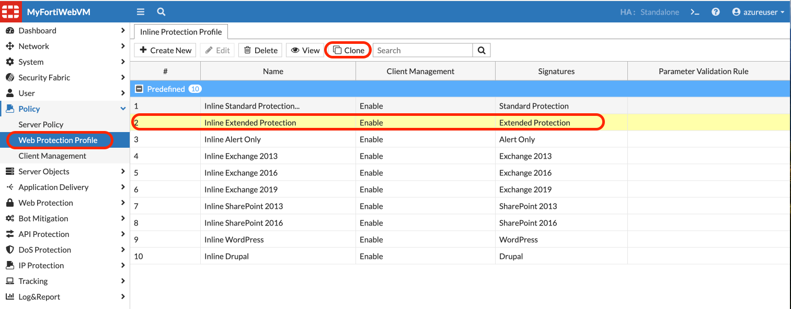
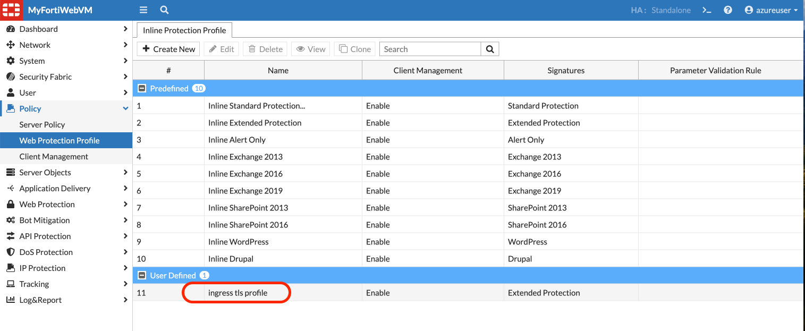
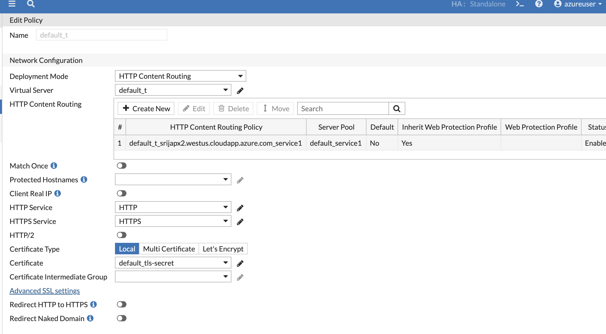
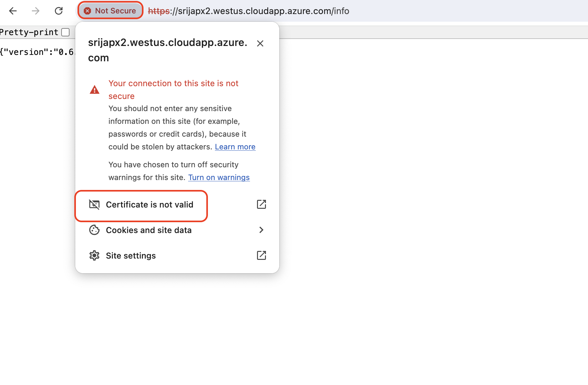
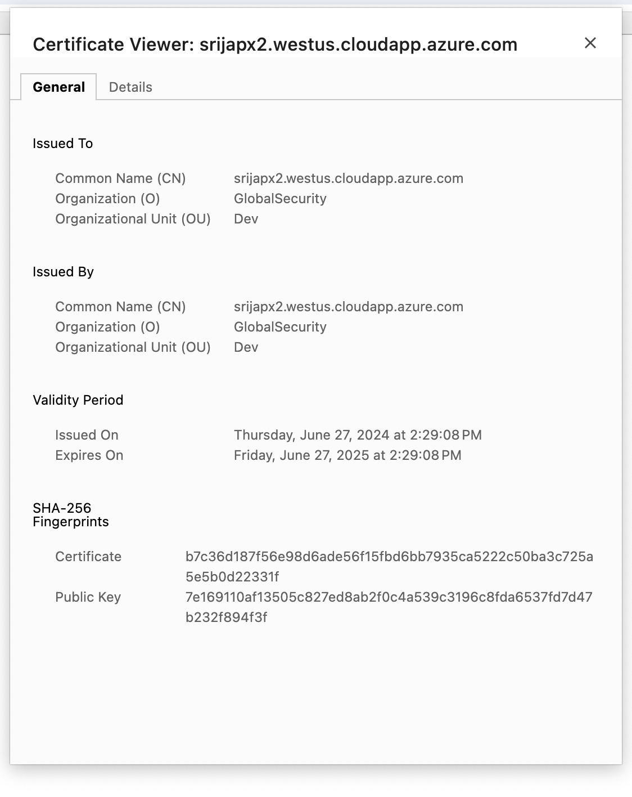

## Setting up basic security features and WAF policies

FortiWeb is a web application firewall (WAF) from Fortinet that offers comprehensive security features designed to protect web applications from various attacks and vulnerabilities. Here are some of the basic security features provided by FortiWeb:

1. Web Application Firewall (WAF)
FortiWeb provides strong protection against common web attacks and vulnerabilities such as SQL injection, cross-site scripting (XSS), and cross-site request forgery (CSRF), among others. It uses both signature-based and behavior-based detection methods to identify threats.

2. DDoS Protection
FortiWeb offers Distributed Denial of Service (DDoS) attack protection to help safeguard your applications from volumetric attacks that aim to overwhelm the system with traffic, rendering the application non-responsive.

3. OWASP Top 10 Protection
FortiWeb is designed to protect against the vulnerabilities listed in the OWASP Top 10, which are the most critical security risks to web applications. This includes injection flaws, broken authentication, sensitive data exposure, and more.

4. Bot Mitigation
FortiWeb includes features to detect and block malicious bots that can perform credential stuffing, scraping, and other automated attacks that can undermine the security and performance of your applications.

5. SSL/TLS Encryption
FortiWeb supports SSL/TLS encryption to secure data in transit between clients and servers. It also provides SSL offloading to help improve the performance of your web servers by handling the encryption and decryption processes.

6. API Protection
With increasing use of APIs in modern applications, FortiWeb provides specialized protections for API-based services, including JSON and XML protection. It ensures that APIs are not exploited to gain unauthorized access or to compromise data.

7. Advanced Threat Protection
FortiWeb integrates with FortiSandbox to offer advanced threat protection, allowing it to analyze files and web content in a safe and isolated environment to detect new malware and zero-day exploits.

8. Machine Learning Capabilities
FortiWeb uses machine learning to dynamically and automatically identify normal behavior and detect anomalies. This helps in protecting against sophisticated threats and reduces false positives without extensive manual intervention.

9. Rate Limiting
To prevent abuse and ensure service availability, FortiWeb allows administrators to set rate limits on incoming requests, thus protecting against brute force attacks and other abusive behaviors by limiting how often a user can repeat actions.

10. IP Reputation and Geo-IP Based Filtering
FortiWeb leverages IP reputation services and Geo-IP based filtering to block traffic from known malicious sources or specific geographic regions, adding an additional layer of security.

These features collectively provide robust protection for web applications, ensuring they remain secure from a wide range of cyber threats while maintaining performance and accessibility. FortiWeb's comprehensive security measures make it an effective solution for businesses looking to safeguard their online operations.

### Lets create a protection profile to use for the TLS based ingress application.

1. **Login to Fortiweb:**

- run the following commands on azure shell:

```bash
echo $fortiwebUsername
echo $fortiwebPassword
echo $vm_name
```

- copy the VM name and use that on a browser to go to: https://**vm_name** 

example: 

https://srijapx2.westus.cloudapp.azure.com

- Login with username and password from above output. 

2. On fortiweb > Policy > Web protection profile > click on "inline extended protection" and click clone at the top and give it a name: ```ingress tls profile```. This profile name will be used later in the Ingress definition file. 





3. Open the cloned protection profile to see there are few modules enabled already. We will update these protection profiles as we perform attacks in the next chapter. 

4. Now lets create the TLS based ingress. 

5. To create TLS based ingress we need to first generate certificate. 

```bash
location="eastus"
fortiwebvmdnslabel="$(whoami)fortiwebvm7"
echo $fortiwebvmdnslabel
vm_name="$fortiwebvmdnslabel.$location.cloudapp.azure.com"
fortiwebvmdnslabelport2="$(whoami)px2.$location.cloudapp.azure.com"
echo $fortiwebvmdnslabelport2
openssl req -new -newkey rsa:4096 -days 365 -nodes -x509 \
    -subj "/C=US/ST=California/L=Sunnyvale/O=GlobalSecurity/OU=Dev/CN=$fortiwebvmdnslabelport2" \
    -keyout cert.key  -out cert.crt
```
You should see cert.crt, cert.key created.

6. Lets create a TLS secret to use the above cert and key.

```kubectl create secret tls tls-secret --cert=cert.crt --key=cert.key```

7. We will tell fortiweb ingress controller use fortiweb port1 ip for API access, and create VIP on Fortiweb Port1 secondary IP, the VIP address is on same subnet with Port1 with last octet set to .100.

use below script to get Fortiweb Port1 and Port1 Secondary IP address , then create yaml file with these IP address

```bash
echo vm_name=$vm_name
rsakeyname="id_rsa_tecworkshop"
ssh-keygen -f "${HOME}/.ssh/known_hosts" -R "${vm_name}" 
output=$(ssh -o "StrictHostKeyChecking=no" azureuser@$vm_name -i ~/.ssh/$rsakeyname 'get system interface')
echo $output
if [ "$fortiwebdeploymode" == "twoarms" ]; then
    portName="port2"
else
    portName="port1"
fi


portip=$(echo "$output" | grep -A 7 "== \[ $portName \]" | grep "ip:" | awk '{print $2}' | cut -d'/' -f1)
echo $portip

portip_first3=$(echo "$portip" | cut -d'.' -f1-3)
```

8.  To generate tlsingress.yaml file run the below code:

```bash
cat << EOF | tee > 08_tls-ingress.yaml 
apiVersion: networking.k8s.io/v1
kind: Ingress
metadata:
  name: m
  annotations: {
    "fortiweb-ip" : $portip,    
    "fortiweb-login" : "fwb-login1",  
    "fortiweb-ctrl-log" : "enable",
    "virtual-server-ip" : $portip_first3.100, 
    "virtual-server-addr-type" : "ipv4",
    "virtual-server-interface" : $portName,
    "server-policy-web-protection-profile" : "ingress tls profile",
    "server-policy-https-service" : "HTTPS",
    "server-policy-http-service" : "HTTP",
    "server-policy-syn-cookie" : "enable",
    "server-policy-http-to-https" : "disable"
  }
spec:
  ingressClassName: fwb-ingress-controller
  tls:
  - hosts: 
     - $fortiwebvmdnslabelport2
    secretName: tls-secret
  rules:
  - host: $fortiwebvmdnslabelport2
    http:
      paths:
      - path: /info
        pathType: Prefix
        backend:
          service:
            name: service1
            port:
              number: 1241
EOF
```

This is will generate **08_tls-ingress.yaml** file

9. Now lets run ```kubectl apply -f 08_tls-ingress.yaml```

output:

```bash
ingress.networking.k8s.io/m created
EOF
```

10. on fortiweb, there will be now a Server policy with Certificate, Web protection profile we created in Step1. 



11. to verify the certificate, please run the belwo ommand in Azure shell. 

```echo $fortiwebvmdnslabelport2```

output:

```bash
srijapx2.eastus.cloudapp.azure.com/info
```

12. In the browser: https://**FQDN**/info

example: https://srijapx2.westus.cloudapp.azure.com/info





we should see the certifcate CN name match your DNS/FQDN.


