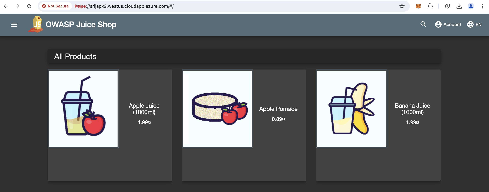
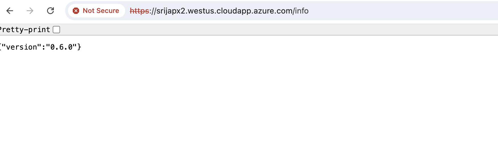

Now lets create some attacks and defenses


{}

1. For that lets create a deployment and Service for Juiceshop application. 

```bash
cat << EOF | tee > juiceshopdeployment.yaml 
apiVersion: apps/v1
kind: Deployment
metadata:
  name: juiceshop-app
spec:
  selector: 
    matchLabels:
     app: juiceshop
  template:
    metadata:
      labels:
        app: juiceshop
    spec:
      containers:
      - name: juiceshop
        image: "bkimminich/juice-shop:snapshot"
EOF
kubectl apply -f juiceshopdeployment.yaml
```
{}
{}


2. Expose the application with a service.

```bash
cat << EOF | tee > juiceshopservice.yaml 
apiVersion: v1
kind: Service
metadata:
  name: juiceshop
  labels:
    app: juiceshop
spec:
  type: NodePort
  selector:
    app: juiceshop
  ports:
  - port: 80
    targetPort: 3000
    protocol: TCP
EOF
kubectl apply -f juiceshopservice.yaml
```

{}
{}

3. Now lets add another path in ingress controller config to get to Juicehsop. Since its already deployed in the previous chapter, lets just update the 08_tls-ingress.yaml file and apply the config.


```bash
cat << EOF | tee > 08_tls-ingress.yaml 
apiVersion: networking.k8s.io/v1
kind: Ingress
metadata:
  name: m
  annotations: {
    "FortiWeb-ip" : $port1ip,    
    "FortiWeb-login" : "fwb-login1",  
    "FortiWeb-ctrl-log" : "enable",
    "virtual-server-ip" : $port1ip_first3.100, 
    "virtual-server-addr-type" : "ipv4",
    "virtual-server-interface" : "port1",
    "server-policy-web-protection-profile" : "ingress tls profile",
    "server-policy-https-service" : "HTTPS",
    "server-policy-http-service" : "HTTP",
    "server-policy-syn-cookie" : "enable",
    "server-policy-http-to-https" : "disable"
  }
spec:
  ingressClassName: fwb-ingress-controller
  tls:
  - hosts: 
     - $FortiWebvmdnslabelport2
    secretName: tls-secret
  rules:
  - host: $FortiWebvmdnslabelport2
    http:
      paths:
      - path: /info
        pathType: Prefix
        backend:
          service:
            name: service1
            port:
              number: 1241
      - path: /
        pathType: Prefix
        backend:
          service:
            name: juiceshop
            port:
              number: 80
 
EOF
```

This is will update and generate the **08_tls-ingress.yaml** file
{}
{}

4. Now lets run
```kubectl apply -f 08_tls-ingress.yaml```

output:

```bash
ingress.networking.k8s.io/m configured.
```
{}
{}
5. the ingress controller will now have two paths. we can check by running:

```kubectl get ingress```

output:

```bash
srija [ ~/k8s-202-workshop/scripts/labEnv ]$ kubectl get ingress
NAME   CLASS                    HOSTS                                ADDRESS    PORTS     AGE
m      fwb-ingress-controller   srijapx2.westus.cloudapp.azure.com   10.0.1.5   80, 443   158m
```

```kubectl describe ingress m```

output:

```bash
Name:             m
Labels:           <none>
Namespace:        default
Address:          10.0.1.5
Ingress Class:    fwb-ingress-controller
Default backend:  <default>
TLS:
  hello-app-tls terminates srijapx2.westus.cloudapp.azure.com
Rules:
  Host                                Path  Backends
  ----                                ----  --------
  srijapx2.westus.cloudapp.azure.com  
                                      /       juiceshop:80 (10.224.0.8:3000)
                                      /info   service1:1241 (10.224.0.14:9876)
Annotations:                          FortiWeb-ctrl-log: disable
                                      FortiWeb-ip: 10.0.1.4
                                      FortiWeb-login: fwb-login1
                                      server-policy-http-service: HTTP
                                      server-policy-http-to-https: disable
                                      server-policy-https-service: HTTPS
                                      server-policy-syn-cookie: enable
                                      server-policy-web-protection-profile: Inline Standard Protection
                                      virtual-server-addr-type: ipv4
                                      virtual-server-interface: port1
                                      virtual-server-ip: 10.0.1.5
Events:                               <none>
```
{}
{}

6. In the web browser:
- if you try going to https://hostname/ 
  - it will redirect to juiceshop, 
- https://hostname/info 
  - will redirect to service1.

example: 

https://srijapx2.westus.cloudapp.azure.com/



https://srijapx2.westus.cloudapp.azure.com/info



{}
