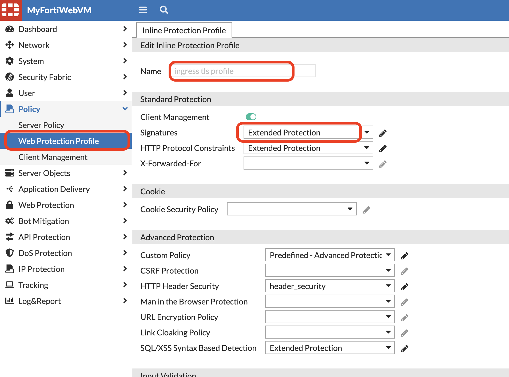
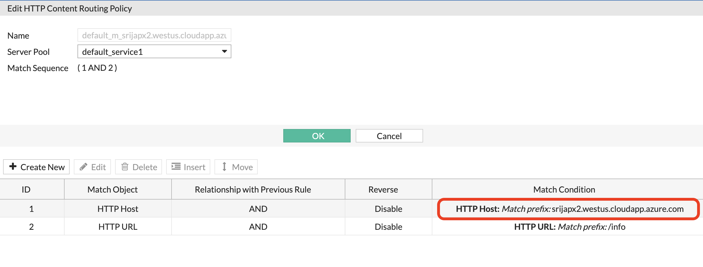
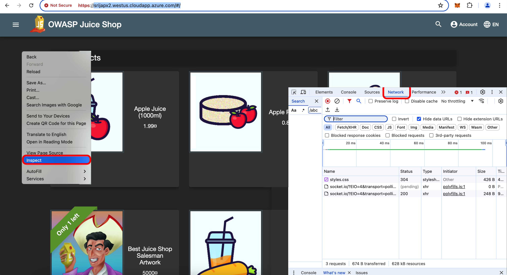
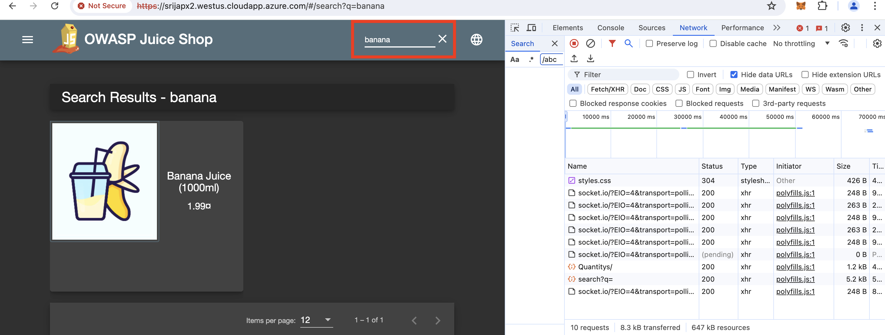
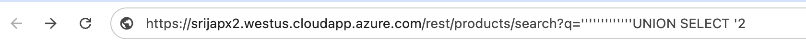
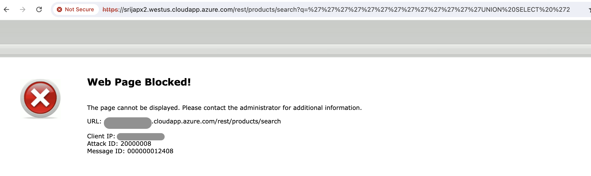
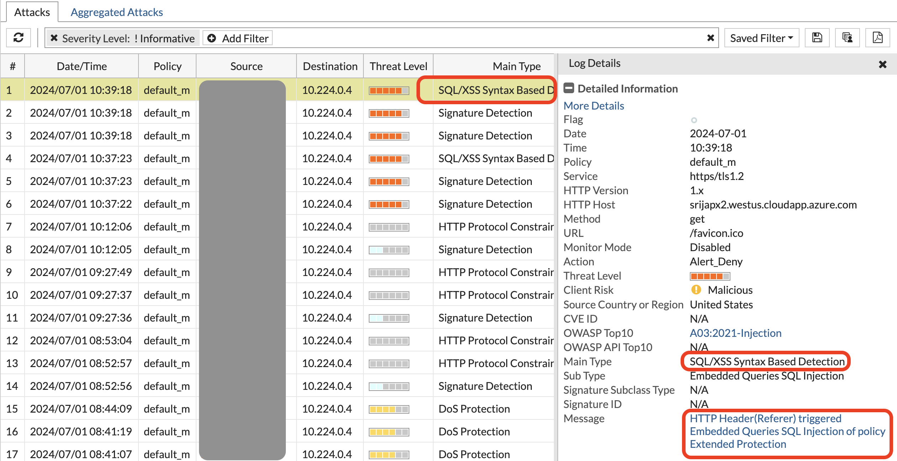

The first attack will be a SQLi attack. Please use Chrome browser to best follow the insrtuctions.


FortiWeb ingress TLS protection profile already has Extended protection enabled for Signature based protection, so we can just continue to do an attack. 



- Proceed with the Attack!


{}
1. To get the Juiceshop hostname, on FortiWeb > Server Objects > Server > HTTP Content Routing > click on one of the content routing policy.

Copy the hostname and enter it into your Chrome browser, followed by '/' prefix. 

Example: https://srijapx2.westus.cloudapp.azure.com/





{}
{}

2. Once the Juiceshop webpage loads
   1. Right-click on the browser page and click on **Inspect** to get to Chrome's Developer Settings.
   2. Click on the **Network** tab in the inspect module. 




{}
{}

3. While viewing the network settings, In the Juiceshop search tab, search for "banana" or "apple" and hit <kbd>enter</kbd>. 
   - You will see a **search?q=** request in the network tab. 
      - Click on that request to see more information about headers, cookies etc. 
      - Notice the backend Request URL, status code, Request method etc. This request URL is the backend URL to the express API of the juiceshop app and this is how attackers inject malicious input to extract data from DB. 
      - Copy this URL and paste into a browser. **do not hit enter yet**
 
         

{}
{}
4. Now instead of the actual search phrase, lets replace it with the SQli payload and paste it in the browser 

```'''''''''''''UNION SELECT '2```

- Example:

```
https://srijapx2.westus.cloudapp.azure.com/rest/products/search?q='''''''''''''UNION SELECT '2
```



- You will see a block page.


{}
{}
5. On FortiWeb > Log and report > Log access > Attack . we should see attack log triggered for SQLi attack.



{}
{}
6. Repeat the same attack with another payload. 

    ```<script>$('input').value="';DELETE FROM USERS;--";$('form').submit()</script>```

example:

```bash
"https://srijapx2.westus.cloudapp.azure.com/rest/products/search?q=<script>$('input').value="';DELETE FROM USERS;--";$('form').submit()</script>"
```

We will see block page again but find out from the attack log what attack this is. 
{}


## Q & A

1. What attack was triggered in step 6?
{}
    SQLi
{}
2. How are signatures helping to block these OWASP TOP 10 attacks?
{}
    Signatures detect patterns of malicious SQL statements, command injection attempts, and other injection payloads.
Example: Detecting 'UNION SELECT' or 'exec xp_' in requests.
{}
