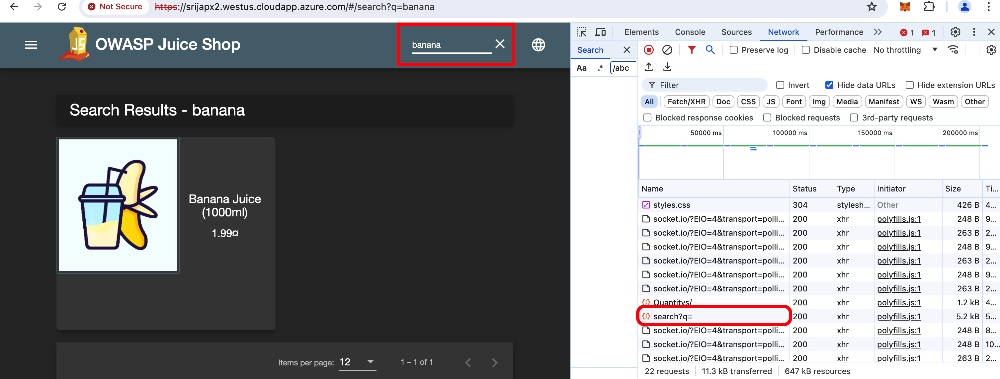


{}

1. The first attack will be a SQLi attack. Please use Chrome browser to best follow the insrtuctions. 


Since the ingress tls protection profile already have Extended protection enabled for Signature based protection, we can just continue to do an attack. 


{}
{}
2. To get the hostname, on FortiWeb > Server Objects > Server > HTTP Content Routing > click on one of the content routing policy.


In the browser copy the hostname, followed by '/' prefix. 

Example:

https://srijapx2.westus.cloudapp.azure.com/ 

{}
{}

3. Once the juiceshop webpage loads, right-click on the browser, click on **inspect** to get to Chrome's Developer Settings. 


{}
{}
4. Click on **Network** tab in the inspect module.


{}
{}

5. While leaving the developer settings, In the Juiceshop search tab, input "banana" or "apple".



{}
{}
6. We can see a **search?q=** request in the network tab. click on that request to see more information about headers, cookies etc.


{}
{}
7. We can see backend Request URL, status code, Request method etc. This request URL is the backend URL to the express API of the juiceshop app and this is how attackers inject malicious input to extract data from DB.

Copy this URL and paste into a browser. **do not hit enter yet**
{}
{}
8. Now instead of the actual search word, lets replace it with the SQli payload and paste it in the browser ```'''''''''''''UNION SELECT '2```

example:

```https://srijapx2.westus.cloudapp.azure.com/rest/products/search?q='''''''''''''UNION SELECT '2```


{}
{}
9. We will see a block page.


{}
{}
10. On FortiWeb > Log and report > Log access > Attack . we should see attack log triggered for SQLi attack.


{}
{}
11. repeat the same with another payload. 

    ```<script>$('input').value="';DELETE FROM USERS;--";$('form').submit()</script>```

example:

```bash
"https://srijapx2.westus.cloudapp.azure.com/rest/products/search?q=<script>$('input').value="';DELETE FROM USERS;--";$('form').submit()</script>"
```

We will see block page again but find out from the attack log what attack this is. 
{}


## Q & A

1. What attack was triggered in step 11?
{}
    The Answer IS...
{}
2. How are signatures helping to block these OWASP TOP 10 attacks?
{}
    The Answer IS...
{}