Lets also explore URL rewriting with FortiWeb. FortiWeb supports several URL rewriting capabilities which can be very important and useful in production applications.

Key uses of URL rewriting on FortiWeb:

- SEO Optimization: Improves search engine rankings by transforming dynamic URLs into static, keyword-rich URLs that are easier for search engines to index.

- User-Friendly URLs: Creates readable and memorable URLs, enhancing the user experience and making it easier for users to navigate the website.

- Hiding Internal URL Structures: Conceals the internal structure and parameters of web applications, adding an extra layer of security and preventing exposure of sensitive details.

- Security Enhancement: Makes it harder for attackers to guess the structure of the web application, reducing the risk of attacks such as parameter tampering or direct access to sensitive endpoints.

- Redirection Management: Manages redirects efficiently, ensuring that users and search engines are directed to the correct pages even after the website structure changes or pages are moved.

- Consistent URL Structure: Ensures uniformity in URL formatting across the website, which aids in site maintenance and improves the overall user experience.


#### Attack1 - Rewriting Policy:

Lets create a rewriting policy to rewrite from Service1 to Juiceshop application.


{}

1. on FortiWeb > Application Delivery > URL rewriting > URL rewriting policy.

Click create new.

**Set:**

- **Action type**: Request Action
- **Request Action**: Redirect (31 Permanently)

**Now in the URL rewrite condition tabel:**

- Click create new

**Set:**

- **HTTP HOST**: your FQDN  

(**FQDN can be found by running ```echo $fortiwebvmdnslabelport2``` in Azure shell.**)

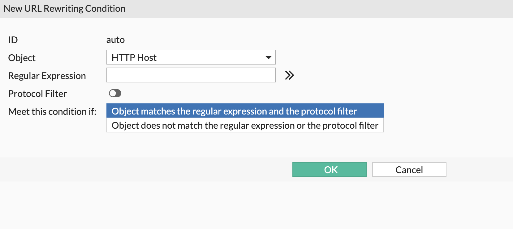

- **HTTP URL**: /info

- **Replacement location**: https://**<FQDN>**/ 

- Click OK.

Finally it looks like below: 

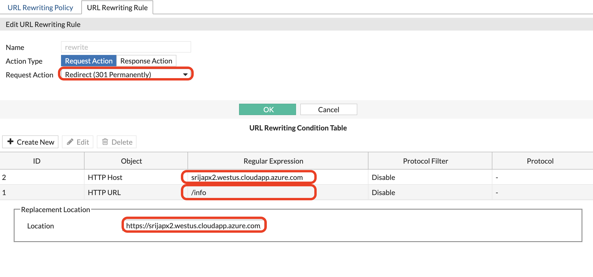

{}
{}
2. Lets create a URL rewriting policy by giving a name.

- click create new and select the Rule we have create in previous step from the drop down. 

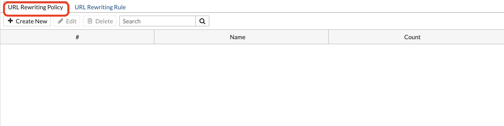

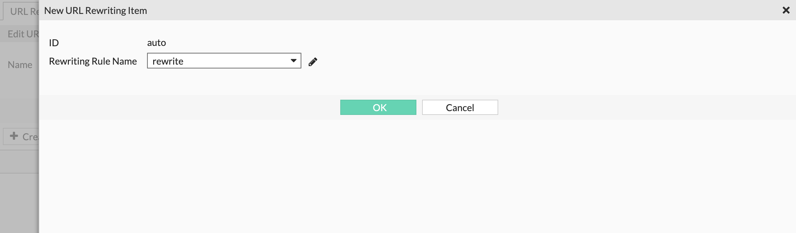

- Finally it looks like below:

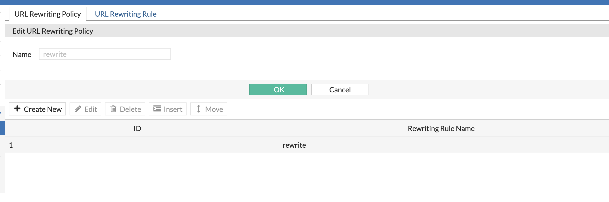

{}
{}
3. Now lets Navigate to Policy > Web protection profile > Edit the ingress tls profile, scroll down to URL rewriting and click on drop down to add the rewrite policy created in Step 2.

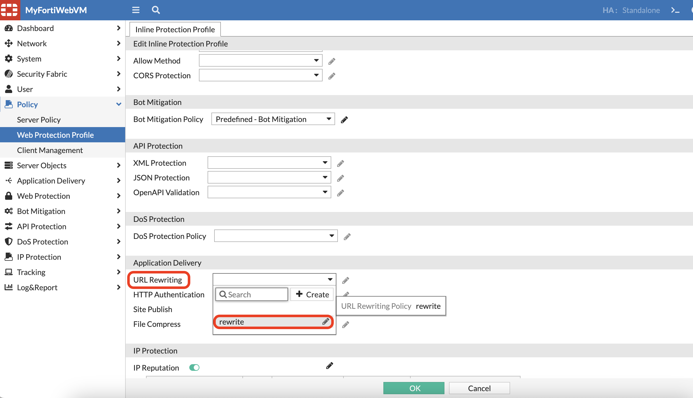

- Click OK.

{}
{}
4. Now when we input https://**<FQDN>**/info in the browser, it will now redirect to juiceshop application automatically. 


{}


#### Attack 1 - DOS protection/Rate limiting:


{}
1. To create a DOS rate limiting policy on FortiWeb > DOS protection > HTTP Access limit > Create new
- Set the HTTP Request Limit/Sec on Standalone iP to 2, Action to Alert and Deny.

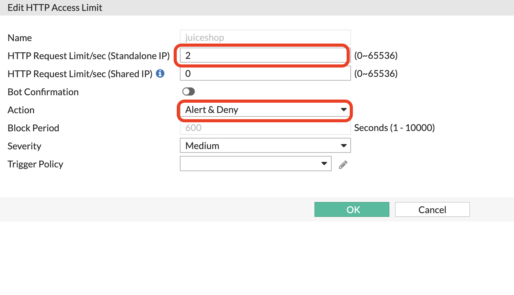
{}
{}

2. Create a DOS protection policy. on FortiWeb DOS Protection > DoS protection policy > Create new
- Give it a name, "enable HTTP DOS prevention"
- select the HTTP Access limit policy create in previous step. 
- Click OK.
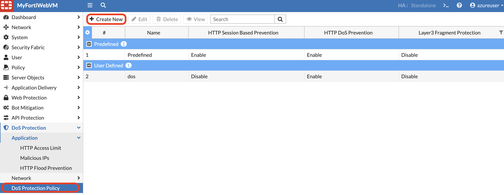

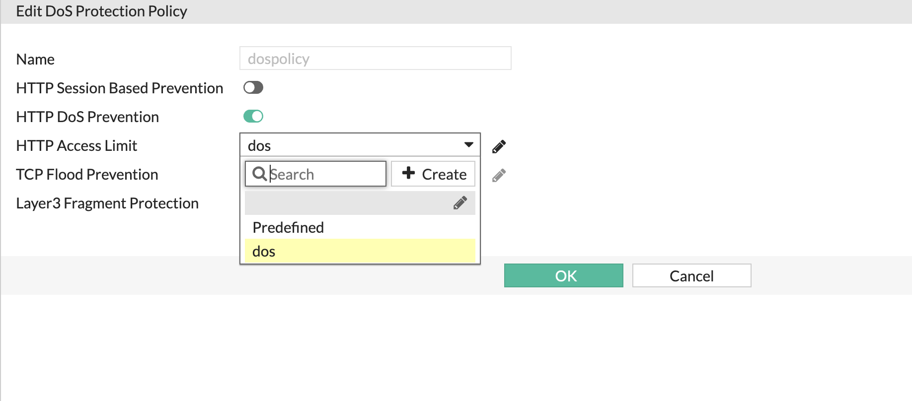
{}
{}
3. Now lets go back to Web protection profile, edit the TLS ingress profile and update the **DOS protection policy** to the policy just created.

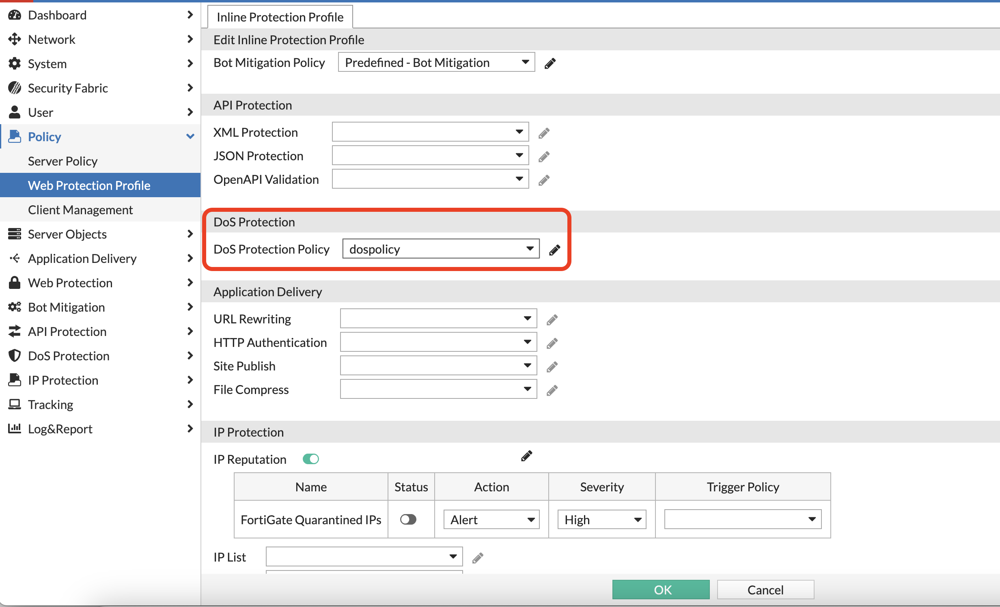

4. Paste the following code into your **Azure Cloudshell**, which creates and executes a sumple python script to send 100 HTTP GET requests to your FortiWeb VM FQDN.

```bash
export fortiwebvmdnslabelport2=$fortiwebvmdnslabelport2
export location=$location
url="https://${fortiwebvmdnslabelport2}"
echo "Sending requests to: $url"

# Loop to run 100 GET requests
for i in {1..100}
do
    # Make the GET request and capture the output
    output=$(curl -s -k -w "\nHTTP Status: %{http_code}" "$url")
    
    # Check if curl command was successful
    if [ $? -eq 0 ]; then
        # Print the output
        echo "Request $i output:"
        echo "$output"
        echo "------------------------"
    else
        echo "Request $i failed"
    fi
    
    # Add a small delay between requests
    sleep 0.1
done

echo "All 100 requests completed."
```

output: 

We will see first few request suceeded , then later request failed due to server blocked it. 

{}
{}
5. Check FortiWeb's atatck log to see an entry for DOS protection attack in **Log and Report > Log access > Attack**.

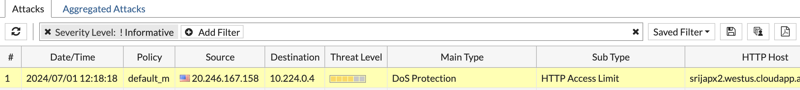
{}

