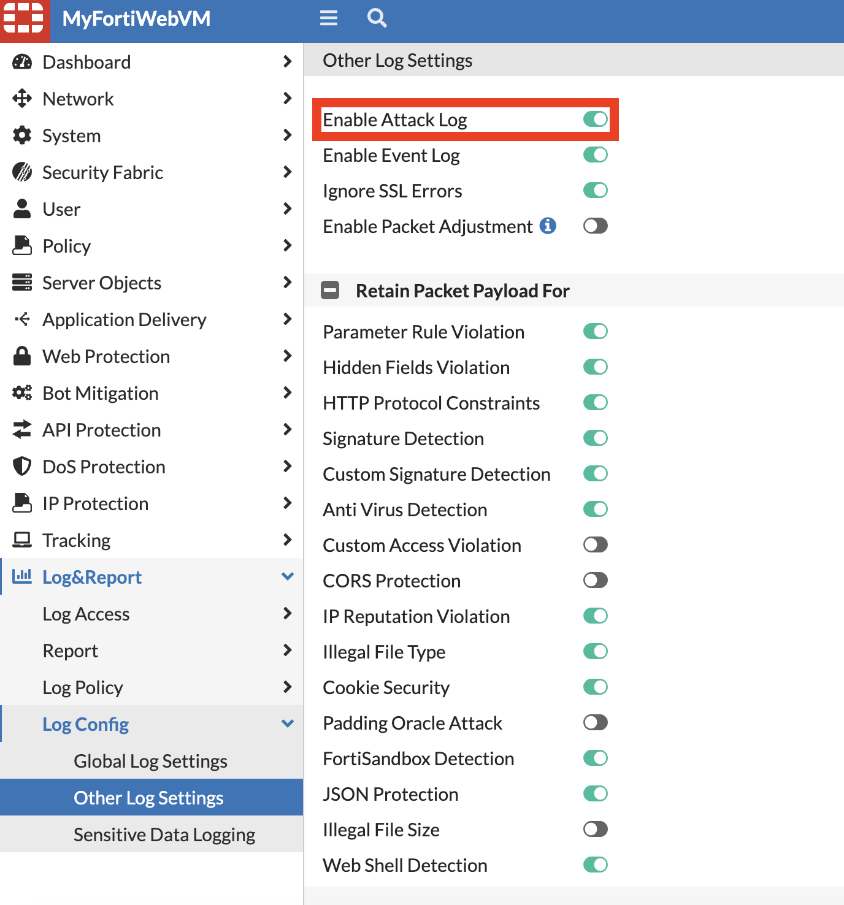
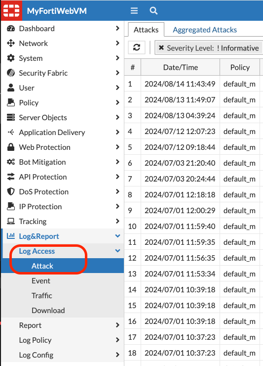
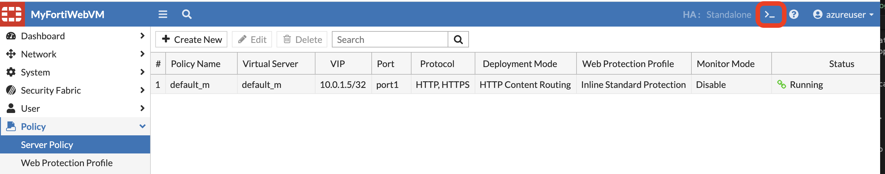

Attack logs and traffic logs are critical components of a comprehensive cybersecurity strategy. Here’s how they can be beneficial:

#### Attack Logs

- Incident Detection and Response: Attack logs provide detailed information about potential security incidents. By analyzing these logs, security teams can identify attack vectors, understand the methods used by attackers, and respond more effectively to mitigate threats.

- Forensic Analysis: In the event of a security breach, attack logs are invaluable for forensic purposes. They help trace the steps taken by the attacker, determine the scope of the breach, and identify compromised data.

- Compliance and Reporting: Many regulatory requirements mandate that organizations must monitor and log access to sensitive data. Attack logs help in demonstrating compliance with these regulations by providing an audit trail of security events.

- Trend Analysis and Threat Intelligence: Over time, attack logs can reveal patterns and trends in security threats. This information can be used to enhance threat intelligence, improve security postures, and proactively defend against future attacks.

Attack log in enabled by default on FortiWeb. To enable or diable attack log:

1. Navigate to Log Settings: Look for the “Log & Report” menu, then find the "log config" > "Other log settings"



2. To view attacks logs: In the “Log & Report” menu > Log Access > Attack



- Traffic Logs
Network Monitoring and Management: Traffic logs record data about the flow of traffic through the network. This data is essential for network performance monitoring, troubleshooting network issues, and ensuring network resources are optimally utilized.

- Security Analysis: By examining traffic logs, organizations can detect anomalies in network traffic that may indicate malicious activity, such as unusual data flows or spikes in traffic to sensitive resources.

- Policy Enforcement: Traffic logs help verify that network usage policies and security controls are being followed. For instance, logs can show whether any prohibited services or applications are being accessed.

- Bandwidth Management: Traffic logs provide insights into bandwidth usage patterns. This information can be used to optimize bandwidth allocation, improve user experience, and reduce costs by identifying unnecessary or excessive usage.

- User and Entity Behavior Analytics (UEBA): By analyzing traffic logs, organizations can build profiles of normal user and system behavior. Deviations from these profiles may indicate potential security or operational issues.

Overall, both attack logs and traffic logs serve as essential tools for maintaining security, ensuring compliance, and optimizing network performance. They provide the visibility needed to manage, secure, and audit information systems effectively.

- To enable traffic log this has be done at policy level from the CLI.

1. Click on CLI of FortiWeb. 



2. run the below commands in the CLI: 

```sh
   config server-policy policy
   edit <policy to enable traffic log>
   set tlog enable
   next
   end
   ```

   for example:

   ```sh 
   config server-policy policy
   edit default_m
   set tlog enable
   next 
   end
   ```

3. To view Traffic logs: In the **“Log & Report” menu > Log Access > Traffic.** 