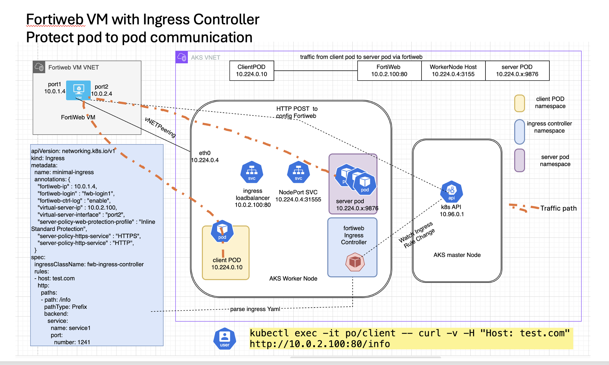

# diagram for pod to pod east-west traffic via fortiweb



```
clientpod ->(port2)-fortiwebVM-(vip:10.0.2.100)--vnetpeering--aksworkernode(10.224.0.4:32371)---sisepod(10.224.0.15:9786)

resourceGroupName: tecworkshop-fortiweb-westus
fortiwebUsername="azureuser"
port1 ip: 10.0.1.4/24
port2 ip: 10.0.2.4/24 
fortiweb vip : 10.0.2.100
fortiwebVM domain: fortiwebvm7.westus.cloudapp.azure.com
fortiweb username : azureuser
fortiweb password : Welcome.123456!
aksworkernode ip: 10.224.0.4
sisepod service name: service1
ingressControllernamespace: fortiwebingress
vnetpeering: 10.0.0.0/16 to 10.224.0.0/24

```
# deploy
```
./01_Create_Azure_VM_New_VNET.sh
./02_install_ingress_controller.sh
./03_create_nodeportsvc.sh
./04_create_ingressYaml.sh
./05_updateNIC2ip.sh
```

# verify

```
06_verify.sh
```
if you see "All checks completed successfully" , then deploy is sucesfful and fortiweb is configured properly.

